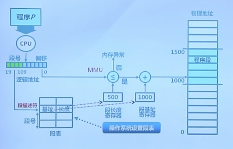

# 物理内存管理

## 计算机体系结构

## 内存层次

## 操作系统的内存管理

## 操作系统的内存管理方式

## 地址空间和地址生成

### 地址空间定义

### 逻辑地址生成

### 地址生成时机和限制

### 地址生成过程

### 地址检查

## 连续内存分配

### 连续内存分配： 动态分区分配

### 最新匹配策略

### 最佳匹配策略

### 最差匹配策略

## 碎片整理

### 碎片整理：紧凑

### 碎片整理：分配对换

## 物理内存管理：非连续性内存分配

### 非连续分配的设计目标

### 非连续内存分配的实现

## 段式存储管理

### 段地址空间

### 段式地址空间的不连续二维结构

### 段访问机制

### 段访问的硬件实现

## 页式存储管理

### 帧(Frame)

### 基于页帧的物理地址计算实例

### 页(Page)

### 页式存储中的地址映射

`页表`

## 页表描述

### 页表结构

### 页表地址转换实例

### 页式存储管理机制的性能问题

## 快表和多级页表

### 快表

### 多级页表

## 反置页表
### 大地址空间问题

### 页寄存器

### 页寄存器的特征

### 页寄存器中的地址转换

### 反置页表

## 段页式存储管理

