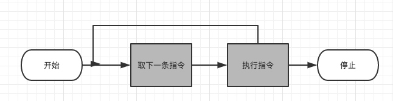

# 计算机系统概述

## 基本构成
- 处理器(Processor): 控制计算机的操作，执行数据处理功能
- 内存(Main memory): 存储数据和程序
- 输入/输出模块(I/O modules): 在计算机和外部环境之间移动数据
- 系统总线(System bug): 为处理器、内存和输入/输出模块间提供通信的设施

## 指令的执行

每个指令周期开始，处理器从存储器中取一条指令.
在典型的处理器中国年，程序计算器(PC)保存下一次要取的指令地址
除非特殊情况，否则处理器在每次取指令后总是递增PC

取到的指令被放置在处理器的指令寄存器中(Instruction Register, IR)

处理器解释指令并执行对应操作
- 处理器－存储器
- 处理器-I/O
- 数据处理 (算术操作或逻辑操作)
- 控制 某些指令可以改变执行顺序

## 中断
事实上所有计算机都提供了允许其他模块(I/O、存储器)中断处理器正常处理过程的机制

`常见中断分类`
- 程序中断: 在某些条件下指令执行的结果产生，如除数为0、算术溢出、试图执行一条非法的机器指令以及访问用户不允许的存储器位置
- 时钟中断: 由处理器内部计时器产生，允许操作系统以一定规律执行函数
- I/O中断: 由I/O控制器产生，用于发信号通知一个操作的正常完成或各种错误条件
- 硬件失效中断: 由诸如断电或存储器奇偶校验错之类的故障产生

## 中断和指令周期
利用中断功能，处理器可以在I/O操作的执行过程中执行其他指令

## 中断处理
中断激活了很多事件，包括处理器硬件中及软件中的事件
当I/O设备完成一次I/O操作时，发生下列硬件事件
- 设备给处理器发出一个中断信号
- 处理器在响应中断前结束当前指令当执行
- 处理器对中断进行测定，确定存在未响应对中断，并给提交中断对设备发送确认信号，确认信号允许该设备取消它对中断信号
- 处理器需要为把控制权转移到中断程序中去做准备
    - (保存从中断点恢复当前程序所需对信息，要求对最少信息包括程序状态字(PSW) 和保存在程序计数器(PC) 中对下一条要执行对指令地址，它们被压入系统控制栈中)
- 处理器把响应此中断对中断处理程序入口地址装入程序计数器中
- 中断处理程序现在可以开始处理中断
- 当中断处理结束后，被保存当寄存器值栈中释放并恢复到寄存器中
- 最后当操作是从栈中恢复PSW和程序计数器当值，其结果是下一条要执行的指令来自前面被中断的程序

## 多个中断 
处理多个中断有两种方法
- 当正在处理中断时，禁止再发生中断 (缺点没有考虑相对优先级和时间限制当要求)
- 定义中断优先级，允许高优先级的中断打断低优先级的中断
